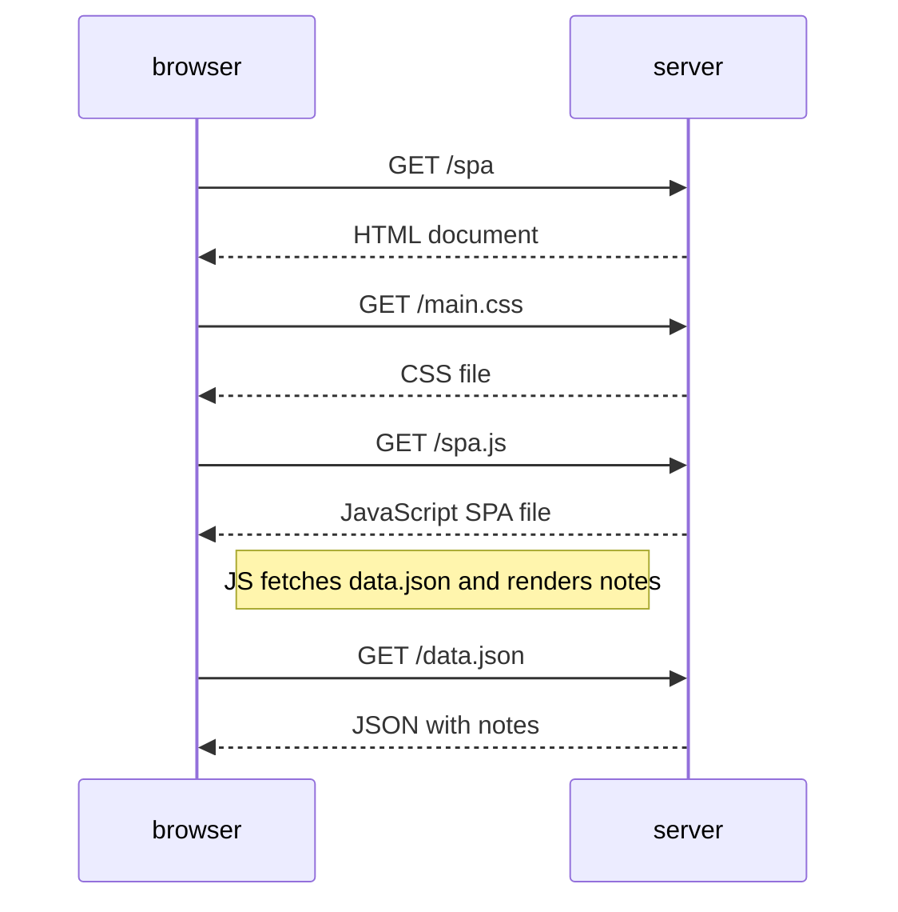

# Exercise 0.5

```mermaid
sequenceDiagram
    participant browser
    participant server

    browser->>server: GET /spa
    server-->>browser: HTML document

    browser->>server: GET /main.css
    server-->>browser: CSS file

    browser->>server: GET /spa.js
    server-->>browser: JavaScript SPA file

    Note right of browser: JS fetches data.json and renders notes
    browser->>server: GET /data.json
    server-->>browser: JSON with notes
``` 
