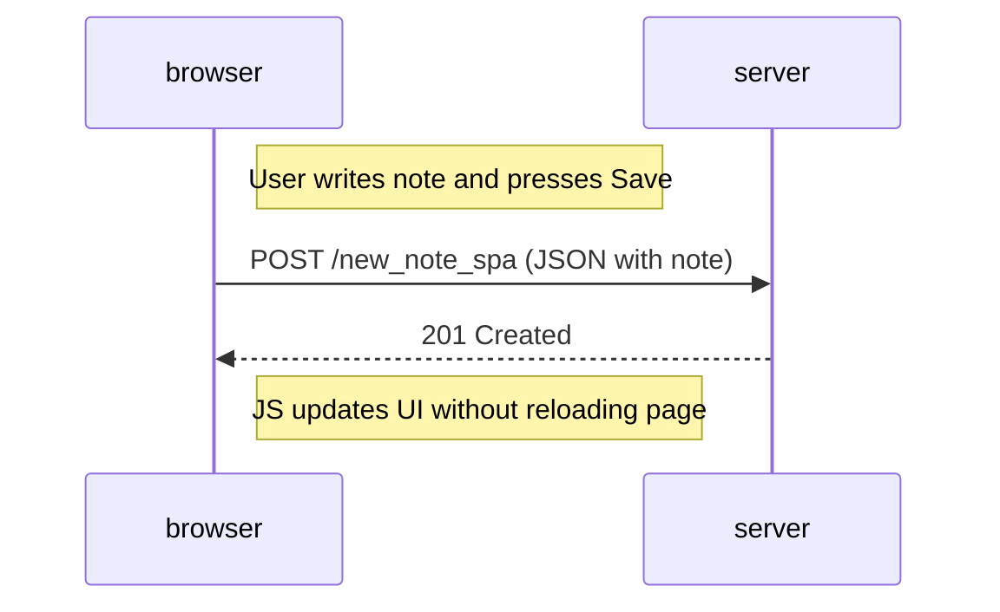

# Exercise 0.6

```mermaid
sequenceDiagram
    participant browser
    participant server

    Note right of browser: User writes note and presses Save
    browser->>server: POST /new_note_spa (JSON with note)
    server-->>browser: 201 Created

    Note right of browser: JS updates UI without reloading page
``` 
